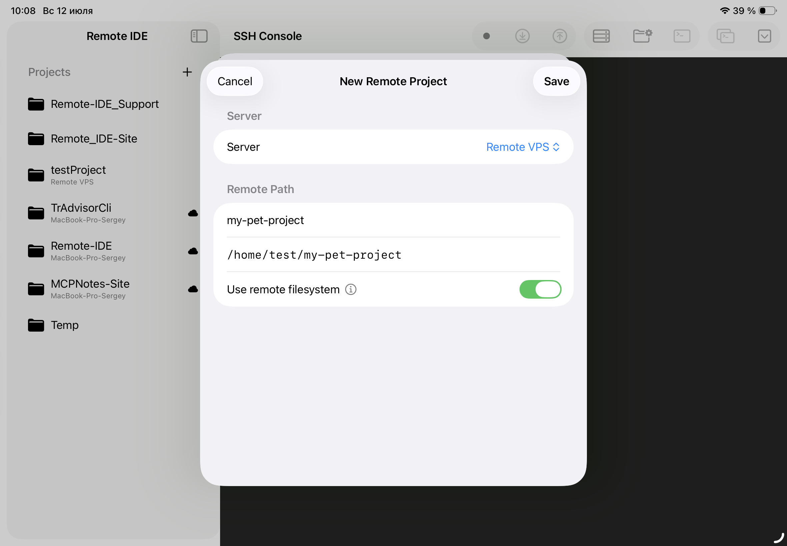
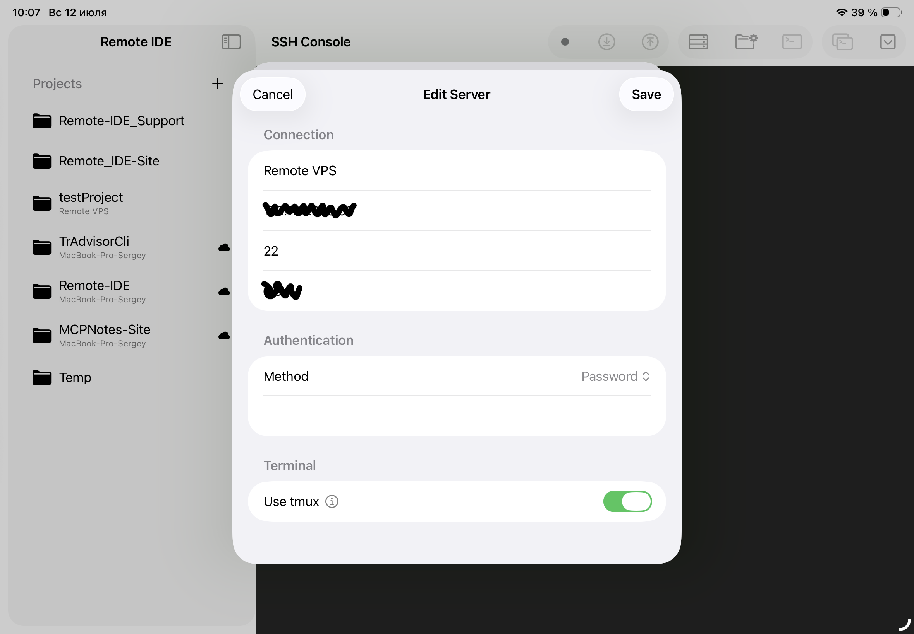

A command-line app isn't the most obvious thing to build on a tablet. No real terminal, no filesystem you're used to from a desktop, no proper multitasking - that's how it looked just a couple of years ago. But move the actual code execution to a remote Linux server and turn the iPad into a thin client for driving an AI agent and reviewing the result, and the picture changes completely. Below is the workflow I've settled on for building Python CLI tools: a VPS + an AI coding agent (Claude Code) in tmux + [Remote IDE](https://remote-ide.com) as a single entry point, all on an iPad with Stage Manager.

<cut />

## Why command-line apps specifically

CLI is a forgiving genre for this kind of workflow. A command-line app has no browser UI to poke at by hand, no visual design that's easier to assemble with a mouse on a big screen. There's code, tests, dependencies, and a command to run it - and the whole "write - run - check the output" loop fits inside a terminal. That's exactly what an AI agent handles best: it writes code, runs it itself, sees the output in the same terminal, and keeps iterating without a human in the loop at every step.

All that loop needs is SSH access to the server running the agent, and a way to look at files and diffs in parallel without losing the agent's session when switching windows. Here's how it plays out, step by step.

## Step one: the server and the project

It all starts with describing a server - a plain form with an address, a port, and an authentication method (password or SSH key; keys and passwords go straight into the device Keychain and nowhere else). After that you create the project itself: a name, a path on the server, and a **"Use remote filesystem"** toggle.

That toggle decides how the project behaves from here on. If it's off, Remote IDE works the usual way - local files in iCloud Drive, manually synced to the server through SFTP buttons in the toolbar. But for a CLI that the agent is building directly on the server, it's far more convenient to turn it on: the project's file tree in the sidebar is then pulled straight from the server over SFTP, and opening or saving a file in the editor writes directly to the remote filesystem. No local copy, no manual syncing, and - importantly - no risk of drifting from what the agent sees and edits in the terminal: the editor and the agent look at the exact same filesystem in real time.

## Step two: tmux - separate windows for the console and the agent

Next is the terminal. The connection settings have a **"Use tmux"** toggle: when it's on, the SSH session gets wrapped in tmux right on the server. The practical upside isn't just that the session survives a dropped connection (close the iPad's cover, lose Wi-Fi - reconnect and everything's still there, including whatever the agent was typing). Inside tmux I keep separate windows for the same project: one is a plain bash shell for git commands, running tests, manual checks; the second runs the CLI agent itself (Claude Code, Codex CLI, and the like). Every project gets its own named tmux session, so the agent and the console for `my-pet-project` never collide with a neighboring project on the same server, and switching between several simultaneous tasks is just switching a tmux window, not hunting for where a session went.

In practice it looks like this: the status bar at the bottom shows the active tmux window for the current project's session - you can keep both bash and the agent open, switching between them without losing context in either.

## Step three: Stage Manager instead of tab-switching

Next comes iPadOS 26's multi-window support. The SSH console with the agent is just one stream of information; in parallel you want to see the code the agent just wrote, and what changed relative to the previous commit. Keeping all of that in one window with constant scrolling is awkward - spreading it across Stage Manager or Split View is exactly what it was built for.

The usual working set looks like this: on the left, a window with the agent's console (Remote IDE in SSH mode); on the right, a second window with the editor and the project's file tree; and, when needed, a third floating window for Git status. These are all independent native app windows that Stage Manager manages the same way it manages windows from different apps: dragging, resizing, remembering the layout between sessions. The agent writes code in the terminal on the left while you flip through files and diffs on the right - without a single context switch.

## Working with files as if they were local

It's the remote filesystem toggle that makes this genuinely seamless. Open the `README.md` the agent just created on the server, and it opens in the editor exactly like a regular local file, with the project's directory tree in the sidebar: `.claude`, `.git`, `.venv`, `src`, `tests`, `pyproject.toml`, `uv.lock`. Edit by hand whatever you feel like fixing yourself, without waiting for the agent - the save goes straight to the server automatically, on every change. No "download, fix, upload back": the editor and the terminal work against the same copy of the files on the server at the same time.

## Syntax highlighting that doesn't feel like a compromise

The editor itself deserves a mention on its own. It's built on [Runestone](https://github.com/simonbs/Runestone) with [Tree-sitter](https://tree-sitter.github.io/tree-sitter/) grammars - so the highlighting isn't regex-based coloring, it's an actual syntax parse for the specific language. Python, TOML, Markdown, YAML, JSON, Shell, and a few dozen other languages are detected automatically from the file extension. Open a `pyproject.toml` the agent just edited, and you see properly highlighted sections and values instead of a wall of grey text - that "this is a real code editor" feeling, not a text field in a monospace font.

## Git diffs without dropping into the console

One of the things that makes a dedicated Git window pay for itself the most, specifically paired with an agent, is a fast visual check of what it actually touched, without typing `git diff` by hand. The list of changed files - marked `A` (added) and similar - opens next to the editor; picking a file immediately shows a line-by-line diff, additions highlighted in green and deletions in red. The agent edited `pyproject.toml`, changing the `description` in the manifest - you see it line by line, without having to ask the agent to summarize what it changed, and without the risk of that summary drifting from the actual diff.

That's especially valuable when the agent finished a task in a few minutes "in the background": you come back not to a wall of chat text, but straight to a list of files and line-by-line changes.

## The keyboard toolbar: a small thing that saves time every single minute

The iPadOS on-screen keyboard isn't built for code - brackets, the period, `=`, `#` are tucked away on secondary layouts, and there's no Tab key at all. Above the keyboard, Remote IDE's editor shows an extra quick-input bar with exactly these symbols: `Tab`, a pair of brackets with the cursor placed between them, a period, an equals sign, and a hash. It's always within reach whenever a text field is active - no need to dive into a third layer of the system keyboard for a single bracket. With a physical keyboard attached, the bar simply isn't needed and stays out of the way.

## What it looks like end to end

Here's a scenario from actual use: I create a new remote project, `my-pet-project`, with the remote filesystem enabled, pointing at a path on the server. In the agent's tmux window I ask it to scaffold a Python CLI with `typer` and `uv` - the agent creates the structure, `pyproject.toml`, `README.md`, tests, runs `uv run`, and shows that the `hello` and `version` commands work. Then it edits `pyproject.toml`, tightening up the `description` - and I see it line by line in the Git window before the agent even reports it back. I ask the agent, "how do I run the app?" - I get the exact commands, `cd`, `uv run my-pet-project hello --name World`, `uv run my-pet-project version` - and try them right there, without leaving the console, in the neighboring tmux window with plain bash. I open `README.md` in the editor - it's already highlighted as Markdown and reads cleanly. All of this is three or four windows on screen at once, with not a single blind tab switch.

## The bottom line

Building command-line apps is about as close to an ideal fit for this setup as it gets: an agent that doesn't need a graphical interface, a server it can actually run on, and an iPad that stops being an "almost workstation" and becomes a full-fledged remote control for the whole process - with syntax highlighting, line-by-line diffs, per-project tmux windows, and multi-window support that finally helps instead of getting in the way.

Remote IDE - to discuss a feature, suggest an idea, or report a problem, head to [GitHub Issues](https://github.com/sergeydi/Remote-IDE_Support/).

---

[Download Remote IDE on the App Store →](https://apps.apple.com/app/remote-ide/id6762590018)

---

**Tags:** iOS development, iPadOS, Swift, DevOps, SSH, CLI, command-line apps, AI, agentic coding, tmux, Git
