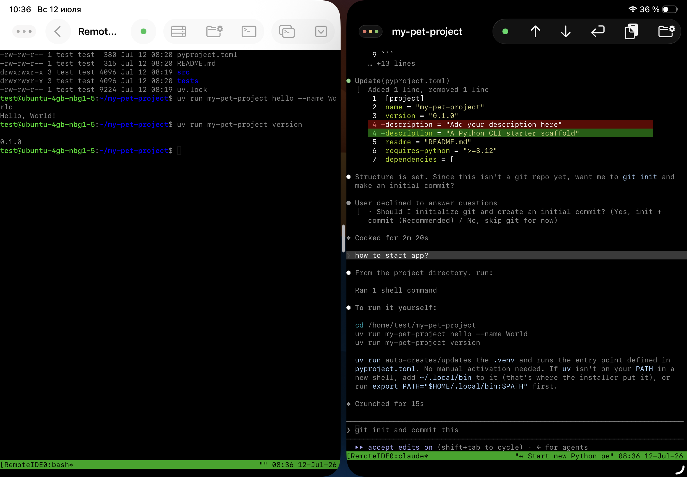
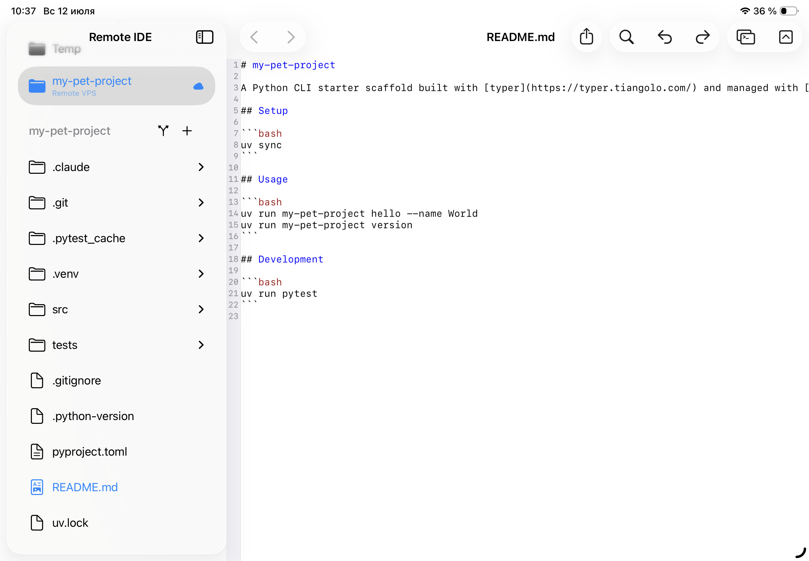
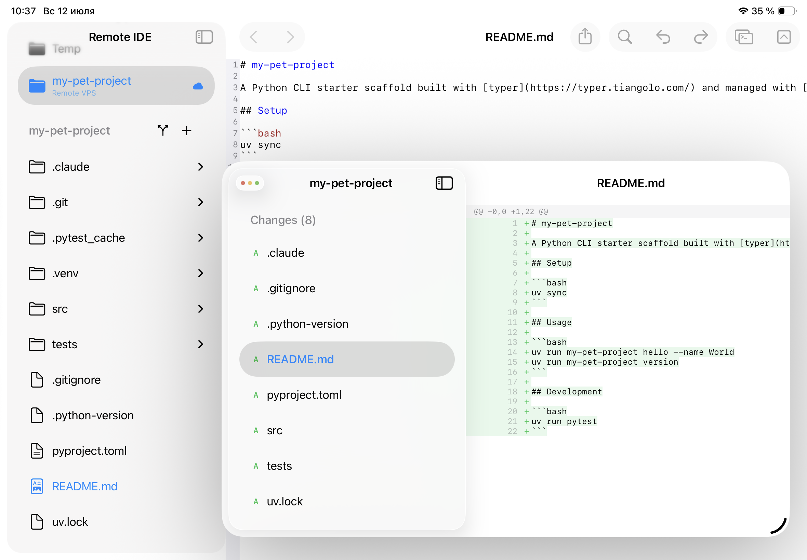

Консольное приложение - не самая очевидная вещь для разработки на планшете. Ни полноценного терминала, ни файловой системы, к которой привыкли на десктопе, ни нормальной многозадачности - так было ещё пару лет назад. Но если вынести сам процесс исполнения кода на удалённый Linux-сервер, а iPad превратить в тонкий клиент для управления AI-агентом и просмотра результата, картина меняется полностью. Ниже - рабочий процесс, который у меня сложился для разработки CLI-инструментов на Python: VPS + AI Coding Agent (Claude Code) в tmux + [Remote IDE](https://remote-ide.com) как единая точка входа, всё на iPad со Stage Manager.

<cut />

## Почему именно консольные приложения

CLI - благодарный жанр для такого рабочего процесса. У консольного приложения нет браузерного UI, который нужно тыкать руками, нет визуального дизайна, который проще собирать мышью на большом экране. Есть код, тесты, зависимости и команда для запуска - и весь цикл «написал - запустил - проверил вывод» укладывается в терминал. Это ровно то, с чем AI-агент справляется лучше всего: он пишет код, сам его запускает, видит вывод в том же терминале и итерирует дальше без участия человека на каждом шаге.

Для такого цикла нужно немного: SSH-доступ к серверу, где крутится агент, и способ параллельно смотреть на файлы и на diff, не теряя сессию агента при переключении между окнами. Дальше - как это выглядит по шагам.

## Шаг первый: сервер и проект

Всё начинается с описания сервера - обычная форма с адресом, портом и способом аутентификации (пароль или SSH-ключ, ключи и пароли уходят исключительно в Keychain устройства). После этого создаётся сам проект: имя, путь на сервере - и переключатель **«Use remote filesystem»**.

Этот переключатель определяет, как проект будет вести себя дальше. Если он выключен, Remote IDE работает как обычно - локальные файлы в iCloud Drive, которые вручную синхронизируются с сервером через SFTP-кнопки в тулбаре. Но для CLI, которое разрабатывает агент прямо на сервере, гораздо удобнее включить его: тогда дерево файлов проекта в сайдбаре подтягивается напрямую с сервера по SFTP, а открытие и сохранение файла в редакторе идёт прямо в удалённую файловую систему. Никакой локальной копии, никакой ручной синхронизации и, что важно, никакого риска разойтись с тем, что видит и правит агент в терминале - редактор и агент смотрят в одну и ту же файловую систему в реальном времени.

## Шаг второй: tmux - раздельные окна для консоли и агента

Дальше - терминал. В настройках подключения есть переключатель **«Use tmux»**: если он включён, SSH-сессия оборачивается в tmux прямо на сервере. Практический смысл этого - не только в том, что сессия переживает разрыв связи (закрыли крышку iPad, потеряли Wi-Fi - при переподключении всё на месте, включая то, что печатал агент). Внутри tmux я держу отдельные окна на один и тот же проект: одно - обычный bash для git-команд, запуска тестов, ручных проверок; второе - запущенный в нём CLI-агент (Claude Code, Codex CLI и подобные). Каждый проект получает свою именованную tmux-сессию, так что между `my-pet-project` и соседним проектом на том же сервере агент и консоль друг другу не мешают, и переключение между несколькими одновременными задачами - это просто переключение tmux-окна, а не поиск, куда делась сессия.

На практике это выглядит так: строка статуса внизу показывает активное окно tmux-сессии текущего проекта - можно держать открытым и bash, и агента, переключаясь между ними без потери контекста ни в одном из них.

## Шаг третий: Stage Manager вместо переключения вкладок

Дальше вступает многооконность iPadOS 26. SSH-консоль с агентом - это ровно один из потоков информации; параллельно хочется видеть код, который агент только что написал, и что изменилось относительно предыдущего коммита. Держать всё это в одном окне с постоянным скроллом неудобно, а вот раскидать по Stage Manager или Split View - то, для чего он и создавался.

Рабочий набор обычно такой: слева - окно с консолью агента (Remote IDE в SSH-режиме), справа - второе окно с редактором и файловым деревом проекта, при необходимости третье - плавающее окно Git-статуса. Всё это независимые нативные окна приложения, которыми Stage Manager управляет так же, как окнами разных приложений: перетаскивание, изменение размера, сохранение раскладки между сессиями. Агент пишет код в терминале слева, вы в это время листаете файлы и diff справа - без единого переключения контекста.

## Работа с файлами так, будто они локальные

Именно включённая удалённая файловая система делает это по-настоящему бесшовным. Открываете `README.md`, который агент только что создал на сервере, - файл открывается в редакторе так же, как обычный локальный файл, с деревом каталогов проекта в сайдбаре: `.claude`, `.git`, `.venv`, `src`, `tests`, `pyproject.toml`, `uv.lock`. Правите руками то, что хочется поправить самому, не дожидаясь агента, - сохранение уходит на сервер автоматически, при каждом изменении. Никакого «скачать - поправить - залить обратно»: редактор и терминал работают с одной и той же копией файлов на сервере одновременно.

## Подсветка синтаксиса, которая не выглядит компромиссом

Отдельно стоит сказать про сам редактор. Он построен на [Runestone](https://github.com/simonbs/Runestone) с грамматиками [Tree-sitter](https://tree-sitter.github.io/tree-sitter/) - то есть подсветка не «раскрашивание по regex», а честный синтаксический разбор для конкретного языка. Python, TOML, Markdown, YAML, JSON, Shell и ещё несколько десятков языков определяются автоматически по расширению файла. Открыв `pyproject.toml`, который агент только что отредактировал, видишь нормально подсвеченные секции и значения, а не единый серый текст - то самое чувство «это настоящий редактор кода», а не текстовое поле с моноширинным шрифтом.

## Git-диффы без ухода в консоль

Одна из вещей, ради которой отдельное окно Git оправдывает себя больше всего именно в связке с агентом, - быстрый визуальный контроль того, что он навносил в файлы, без набора `git diff` руками. Список изменённых файлов - с пометками `A` (added) и подобными - открывается рядом с редактором; выбор файла сразу показывает построчный diff с подсветкой добавленного зелёным и удалённого красным. Агент отредактировал `pyproject.toml`, поменяв `description` в манифесте, - это видно построчно, без необходимости просить у него самого пересказать, что он изменил, и без риска, что пересказ разойдётся с реальным диффом.

Это особенно ценно, когда агент выполнил задачу за несколько минут «в фоне»: возвращаешься не к стене текста в чате, а сразу к списку файлов и построчным изменениям.

## Тулбар клавиатуры: мелочь, которая экономит время каждую минуту

Экранная клавиатура iPadOS не заточена под код - скобки, точка, `=`, `#` спрятаны на дополнительных раскладках, а Tab на ней вообще нет. Над клавиатурой в редакторе Remote IDE появляется дополнительная панель быстрого ввода именно с этими символами: `Tab`, парой скобок с курсором между ними, точкой, равно и решёткой. При активном текстовом поле она всегда под рукой - не нужно нырять в третий слой системной клавиатуры ради банальной скобки. При работающей физической клавиатуре панель, разумеется, не нужна и не мешает.

## Как это выглядит целиком

Собираю сценарий из практики: создаю новый remote-проект `my-pet-project` с включённой удалённой файловой системой, указываю путь на сервере. В tmux-окне агента прошу собрать каркас Python CLI на `typer` и `uv` - агент создаёт структуру, `pyproject.toml`, `README.md`, тесты, запускает `uv run` и показывает, что команды `hello` и `version` работают. Дальше правит `pyproject.toml` - уточняет `description` - и я вижу это построчно в Git-окне, ещё до того, как агент сам об этом отчитался. Спрашиваю у агента: «как запустить приложение?» - получаю точные команды `cd`, `uv run my-pet-project hello --name World`, `uv run my-pet-project version` - тут же, не выходя из консоли, пробую их в соседнем tmux-окне с обычным bash. Открываю `README.md` в редакторе - он уже подсвечен по Markdown, читается нормально. Всё это - три-четыре окна на экране одновременно, ни одного переключения вкладок вслепую.

## Итог

Разработка консольных приложений - едва ли не идеальный случай для этой связки: агент, которому не нужен графический интерфейс, сервер, на котором он и работает, и iPad, который перестаёт быть «почти рабочей станцией» и становится полноценным пультом управления всем процессом - с подсветкой синтаксиса, построчными диффами, раздельными tmux-окнами на проект и многооконностью, которая наконец не мешает, а помогает.

Remote IDE - обсудить функциональность, предложить идею или сообщить о проблеме можно в [GitHub Issues](https://github.com/sergeydi/Remote-IDE_Support/).

---

[Загрузить Remote IDE в App Store →](https://apps.apple.com/app/remote-ide/id6762590018)

---

**Теги:** iOS разработка, iPadOS, Swift, DevOps, SSH, CLI, консольные приложения, AI, агентное программирование, tmux, Git
