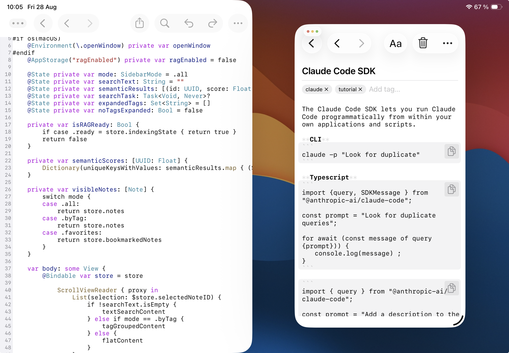

It sounds like a contradiction: the iPad has become a genuinely capable tool for developers, yet you still can't build an app for it — or for iPhone — without a Mac. Xcode, the only official environment for building and signing iOS apps, exists solely on macOS, and Apple shows no sign of changing that. Does this mean the entire development cycle has to happen at a desk? No — not if the Mac is always reachable over the network, and the iPad can reach it remotely.

## Remote IDE as the working interface

Controlling a remote Mac from an iPad takes more than just network access — it takes a proper working tool. That's where [Remote IDE](https://apps.apple.com/app/remote-ide/id6762590018) comes in: an iPadOS app that combines an SSH console, a syntax-highlighting code editor, and a Git diff viewer in one place, with full Stage Manager support. For iOS development on a remote Mac, this covers almost the entire cycle:

- **SSH console** — the entry point for running `xcodebuild`, git commands, and an AI agent (such as [Claude Code](https://www.anthropic.com)) directly on the Mac. Credentials live only in the device's Keychain.
- **Editor connected to the remote filesystem** — open a `.swift` file on the Mac exactly as you would a local one, edit it by hand when you want to fix something yourself instead of waiting on the agent — saves land on the Mac instantly.
- **Git window** — a line-by-line diff of what the agent changed, without running `git diff` in the console and squinting at raw text output on a small terminal screen.

These are all separate native windows that Stage Manager controls independently: console on the left, editor on the right, diff floating on top.

## Why you still need a Mac

Even in the most agent-driven workflow — where an AI agent writes most of the code, not a human — some things only happen on macOS:

- **Compiling and signing.** `xcodebuild` and the entire Swift/Objective-C toolchain for iOS build and code-sign only on a Mac.
- **Installing on a device.** Deploying a built `.app` to a connected iPhone or iPad also requires a Mac (or TestFlight, which is a separate, far slower cycle).
- **Simulator and Interface Builder previews.** Live SwiftUI previews and the iOS Simulator are also macOS-exclusive.

In other words, the "brain" of the build fundamentally lives on the Mac. The question is whether you have to be physically next to that Mac to use it. The answer is no.

## What this looks like in practice: MCP Notes

To keep this from staying theoretical, here's a real scenario from developing [MCP Notes](https://github.com/sergeydi/MCP-Notes) — an open-source notes app with tags, semantic (RAG) search, wiki-links, and a shared database for Mac and iOS/iPadOS — that's currently under active development.

The project already builds and runs on the Mac, but it needs to be checked in iPhone-compatibility mode on the iPad (the scaled-up interface, not the native iPad layout). Instead of dealing with this by hand, the task goes straight to the agent in Remote IDE's SSH console: "build the iPhone version of the app and install it on my iPad."

The agent (Claude Code) acts autonomously: finds the `TARGETED_DEVICE_FAMILY` setting in the project, confirms it's already set to `1` (iPhone-only) for the Debug configuration, asks which physical iPad to target the build at, runs `xcodebuild`, installs, and launches the app — all through a handful of shell commands run on the Mac over SSH, without a single tap inside Xcode itself.

While the agent works on the next task — reworking the sidebar logic (`SidebarView.swift`) to add a dedicated `.search` mode instead of checking `!searchText.isEmpty` throughout the code — the Remote IDE editor stays open on that same file, connected directly to the Mac's filesystem.

You can open the Git window alongside it and read the diff line by line: where `preSearchMode` was added, how `onChange` was rewritten to restore the previous mode when search is entered and exited. Nothing needs to be described in words — the whole patch is visible line by line, in green and red.

There's also a separate file browser window handy for a quick scan of the project structure — `Models`, `NoteIndexer`, `Services`, `ViewModels`, `Views/Sidebar` — without leaving the app or flipping through Xcode's tabs.

## tmux: several parallel sessions over one SSH connection

A single SSH session usually isn't enough for comfortable work: the agent needs its own window, and you also want a plain bash shell close at hand — to run tests, check `git log`, or run a command by hand while the agent is busy with its own task. Remote IDE's **"Use tmux"** connection setting handles this: when it's on, the SSH session gets wrapped in tmux right on the server (in this case, the Mac).

Beyond the obvious upside — the session survives a dropped connection: close the iPad's lid or lose Wi-Fi, reconnect, and everything's still there, including whatever the agent was typing — this is also a convenient way to split one SSH connection into several independent windows: one for a plain shell, another for Claude Code. Each project gets its own named tmux session, so the agent and console for one project never get mixed up with a neighboring one, and switching between several parallel tasks is just switching a tmux window, not hunting for where a session went. The status line at the bottom of the console shows the active tmux window for the current session, so you always know where you are without leaving the terminal.

## Stage Manager: several Remote IDE windows at once

tmux on its own solves the problem of multiple windows *inside* one SSH connection, but it really pays off when several independent Remote IDE windows — not tabs within one window — are open side by side on screen. That's exactly what [Stage Manager](https://support.apple.com/en-gb/105075) provides in iPadOS 26: a full multi-window mode with freely sized and positioned, overlapping windows, and quick switching between window sets.

A typical layout looks like this: on the left, a window with the SSH console and Claude Code; on the right, a second Remote IDE window with the editor and the project's file tree; and, when needed, a third floating window with Git status. These are independent native app windows that Stage Manager manages just like windows of different apps — dragging, resizing, remembering the layout between sessions.

The result is a desktop where the agent writes and builds code in one window while you browse files and diffs in the others at the same time — no blind tab-switching involved.

## Remote access to the Mac: Tailscale and similar tools

Everything described above works under one condition: the Mac has to be reachable over the network from wherever you are with the iPad. That doesn't require a static IP, port forwarding, or a complicated VPN server setup — an app like [Tailscale](https://tailscale.com) is enough, building a mesh network over WireGuard between your devices. Install the client on the Mac and the iPad, sign in with the same account, and the Mac becomes reachable at a stable internal address no matter where you connect from — home, a café, anywhere. SSH, VNC, any self-hosted service on the Mac — it all works as if you were on the same local network.

That removes the main practical barrier: the Mac can sit at home or in an office, taken out of the equation of "where am I physically right now" — and Remote IDE plus the AI agent handle the rest.

## Wrapping up

The lack of Xcode on iPadOS isn't a dead end — it's just a reason to move the build to a separate machine and connect to it remotely. The combination of "Tailscale for network access + Remote IDE as a single entry point for SSH, editing, and Git + an AI agent driving `xcodebuild` itself" covers the entire iPhone app development cycle right from an iPad: from editing code and reviewing diffs to building and installing on a real device.

[MCP Notes](https://mcp-notes.com), discussed above, is an actively developed open-source app ([repository on GitHub](https://github.com/sergeydi/MCP-Notes)), and it's exactly where this workflow gets tested in practice, day after day.

Remote IDE — to discuss a feature, suggest an idea, or report a problem, head to [GitHub Issues](https://github.com/sergeydi/Remote-IDE_Support).

---

[Download Remote IDE on the App Store →](https://apps.apple.com/app/remote-ide/id6762590018)

---

**Tags:** iOS development, iPadOS, Xcode, Swift, remote development, Tailscale, SSH, AI agents, Claude Code, mobile development
