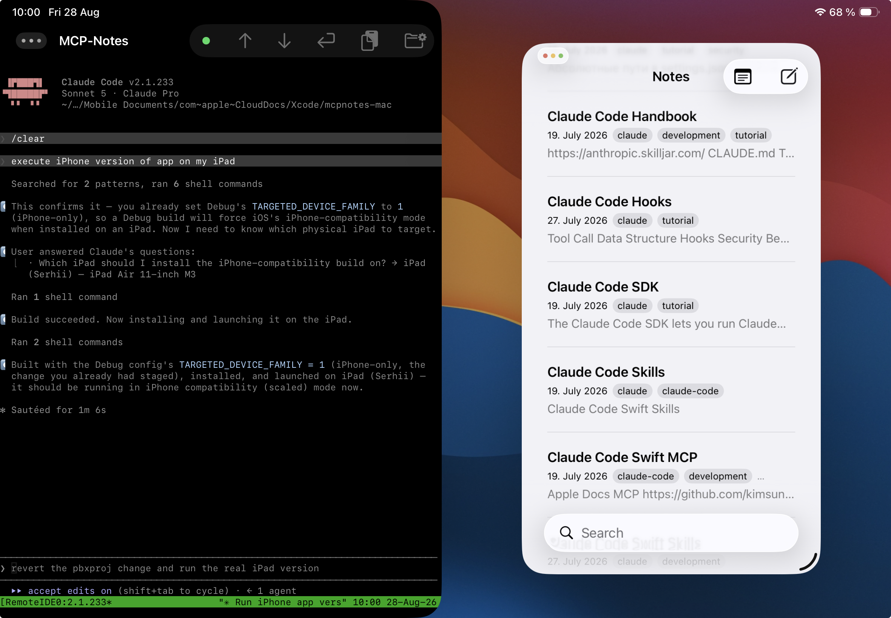

Звучит как противоречие: iPad стал вполне рабочим инструментом разработчика, а собрать под него (и под iPhone) приложение всё равно нельзя без Mac. Xcode — единственная официальная среда сборки и подписи iOS-приложений — существует только под macOS, и Apple явно не планирует это менять. Значит ли это, что весь цикл разработки придётся выполнять, сидя за компьютером? Нет — если Mac всегда доступен по сети, а с iPad до него можно дотянуться удалённо.

## Remote IDE как рабочий интерфейс

Чтобы управлять удалённым Mac с iPad, нужен не просто доступ по сети, а удобный рабочий инструмент. Здесь в игру вступает [Remote IDE](https://apps.apple.com/app/remote-ide/id6762590018) — приложение для iPadOS, объединяющее SSH-консоль, редактор кода с подсветкой синтаксиса и просмотр Git-diff в одном месте, с полной поддержкой Stage Manager. Для разработки iOS-приложений на удалённом Mac это закрывает практически весь цикл:

- **SSH-консоль** — точка входа для запуска `xcodebuild`, git-команд и AI-агента (например, [Claude Code](https://www.anthropic.com)) прямо на Mac. Учётные данные хранятся только в Keychain устройства.
- **Редактор с подключением к удалённой файловой системе** — открываете `.swift`-файл на Mac так же, как локальный, правите вручную, если нужно что-то поправить самому, а не ждать агента — сохранение уходит на Mac моментально.
- **Git-окно** — построчный diff того, что изменил агент, без необходимости гонять `git diff` в консоли и читать текстовый вывод построчно на маленьком экране терминала.

Всё это — отдельные нативные окна, которыми Stage Manager управляет независимо: можно держать консоль слева, редактор справа, а diff — плавающим окном сверху.

## Почему Mac всё равно нужен

Даже при максимально агентном рабочем процессе, где основную часть кода пишет AI-агент, а не человек, есть вещи, которые происходят только на macOS:

- **Компиляция и подпись.** `xcodebuild` и весь тулчейн Swift/Objective-C для iOS собираются и подписываются кодом только на Mac.
- **Установка на устройство.** Развернуть собранный `.app` на подключённый iPhone или iPad тоже можно только с Mac (либо через TestFlight, но это отдельный, куда более медленный цикл).
- **Симулятор и Interface Builder-превью.** Live-превью SwiftUI, симулятор iOS — тоже macOS-эксклюзив.

Другими словами, «мозг» сборки принципиально живёт на Mac. Вопрос в том, обязательно ли физически находиться рядом с этим Mac, чтобы им пользоваться. Ответ — нет.

## Как это выглядит на практике: MCP Notes

Чтобы не ограничиваться теорией, вот реальный сценарий из разработки [MCP Notes](https://github.com/sergeydi/MCP-Notes) — приложения-заметок с открытым исходным кодом, с тегами, семантическим (RAG) поиском по вики-ссылкам и общей базой данных для Mac и iOS/iPadOS, — над которым сейчас идёт работа.

Проект уже собирается и запускается на Mac, но нужно проверить, как приложение ведёт себя в режиме iPhone-совместимости на iPad (масштабированный интерфейс, а не нативный iPad-layout). Вместо того чтобы возиться с этим руками, задача формулируется агенту прямо в SSH-консоли Remote IDE: «собери iPhone-версию приложения и установи на мой iPad».

Агент (Claude Code) действует автономно: находит в проекте настройку `TARGETED_DEVICE_FAMILY`, подтверждает, что для конфигурации Debug она уже выставлена в `1` (только iPhone), уточняет у пользователя, на какой физический iPad ставить сборку, запускает `xcodebuild`, устанавливает и запускает приложение — и всё это через несколько shell-команд, выполненных на Mac по SSH, без единого нажатия в самом Xcode.

Пока агент работает над следующей задачей — правит логику боковой панели (`SidebarView.swift`), добавляя отдельный режим `.search` вместо разбора `!searchText.isEmpty` по всему коду, — редактор Remote IDE открыт на том же файле, подключённом напрямую к файловой системе Mac.

Можно параллельно открыть Git-окно и построчно посмотреть diff: где добавился `preSearchMode`, как переписан `onChange` для сохранения предыдущего режима при входе и выходе из поиска. Ничего не нужно пересказывать словами — весь патч виден построчно, зелёным и красным.

Здесь же, в отдельном окне файлового менеджера, удобно быстро пробежаться по структуре проекта — `Models`, `NoteIndexer`, `Services`, `ViewModels`, `Views/Sidebar` — не выходя из приложения и не листая вкладки Xcode.

## tmux: несколько параллельных сессий в одном SSH-соединении

Одной SSH-сессии для комфортной работы обычно мало: агенту нужно своё окно, а параллельно хочется иметь под рукой обычный bash — прогнать тесты, посмотреть `git log`, вручную выполнить команду, пока агент занят своей задачей. Решается это переключателем **«Use tmux»** в настройках подключения Remote IDE: если он включён, SSH-сессия оборачивается в tmux прямо на сервере (в нашем случае — на Mac).

Помимо очевидного плюса — сессия переживает обрыв связи: закрыли крышку iPad или потеряли Wi-Fi, переподключились — и всё на месте, включая то, что печатал агент, — это ещё и удобный способ разделить одно SSH-соединение на несколько независимых окон: одно под обычный shell, второе — под Claude Code. У каждого проекта — своя именованная tmux-сессия, поэтому агент и консоль для одного проекта никогда не путаются с соседним, а переключение между несколькими параллельными задачами — это просто переключение tmux-окна, а не поиск, куда делась сессия. Строка состояния внизу консоли показывает активное tmux-окно текущей сессии, так что видно, где вы находитесь, не выходя из терминала.

## Stage Manager: несколько окон Remote IDE одновременно

Сам по себе tmux решает проблему нескольких окон *внутри* одного SSH-соединения, но по-настоящему удобно это работает, когда рядом на экране одновременно открыты несколько независимых окон самого Remote IDE — а не вкладки внутри одного. Именно это и даёт [Stage Manager](https://support.apple.com/en-gb/105075) в iPadOS 26: полноценный многооконный режим с произвольным размером и расположением окон, перекрывающимися окнами и быстрым переключением между рабочими наборами.

Типичная раскладка выглядит так: слева — окно с SSH-консолью и Claude Code; справа — второе окно Remote IDE с редактором и деревом файлов проекта; и, при необходимости, третье плавающее окно — с Git-статусом. Это независимые нативные окна приложения, которыми Stage Manager управляет так же, как окнами разных приложений: перетаскивание, изменение размера, запоминание раскладки между сессиями.

В сумме получается рабочий стол, на котором агент пишет и собирает код в одном окне, пока вы одновременно листаете файлы и diff в соседних — без единого «слепого» переключения между вкладками.

## Удалённый доступ к Mac: Tailscale и его аналоги

Всё описанное выше работает только при одном условии: Mac должен быть доступен по сети из любой точки, где вы находитесь с iPad. Для этого не нужен статический IP, проброс портов или сложная настройка VPN-сервера — достаточно приложений вида [Tailscale](https://tailscale.com), которые строят mesh-сеть поверх WireGuard между вашими устройствами. Ставите клиент на Mac и на iPad, авторизуетесь одним аккаунтом — и Mac становится доступен по стабильному внутреннему адресу, откуда бы вы к нему ни подключались, хоть из дома, хоть из кафе. SSH, VNC, любой самостоятельно поднятый сервис на Mac — всё работает так, будто вы в одной локальной сети.

Это снимает главный практический барьер: Mac может стоять дома или в офисе и быть выключенным из уравнения «где я физически нахожусь» — а Remote IDE и AI-агент делают всё остальное.

## Итог

Отсутствие Xcode под iPadOS — не тупик, а просто повод вынести сборку на отдельную машину и подключаться к ней удалённо. Связка «Tailscale для сетевого доступа + Remote IDE как единая точка входа в SSH, редактор и Git + AI-агент, который сам гоняет `xcodebuild`» закрывает весь цикл разработки iPhone-приложения прямо с iPad: от правки кода и ревью diff'ов до сборки и установки на реальное устройство.

MCP Notes, о котором шла речь выше, — активно разрабатываемое приложение с открытым исходным кодом ([репозиторий на GitHub](https://github.com/sergeydi/MCP-Notes)), и как раз на нём этот рабочий процесс обкатывается на практике день за днём.

Remote IDE — обсудить фичу, предложить идею или сообщить о проблеме можно в [GitHub Issues](https://github.com/sergeydi/Remote-IDE_Support).

---

[Скачать Remote IDE в App Store →](https://apps.apple.com/app/remote-ide/id6762590018)

---

**Теги:** iOS разработка, iPadOS, Xcode, Swift, удалённая разработка, Tailscale, SSH, AI-агенты, Claude Code, мобильная разработка
