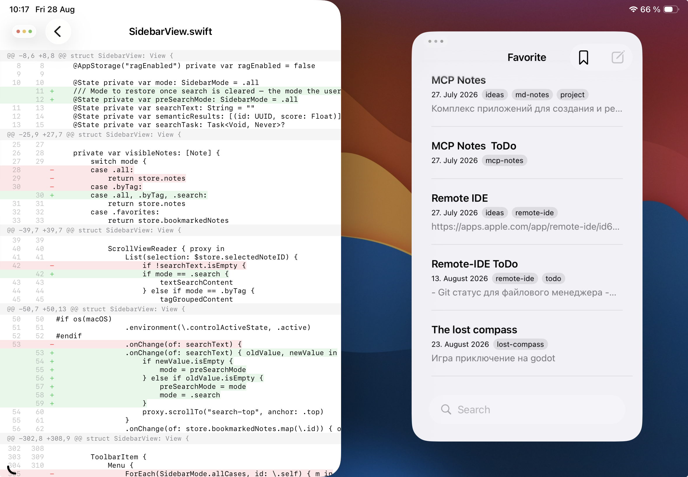
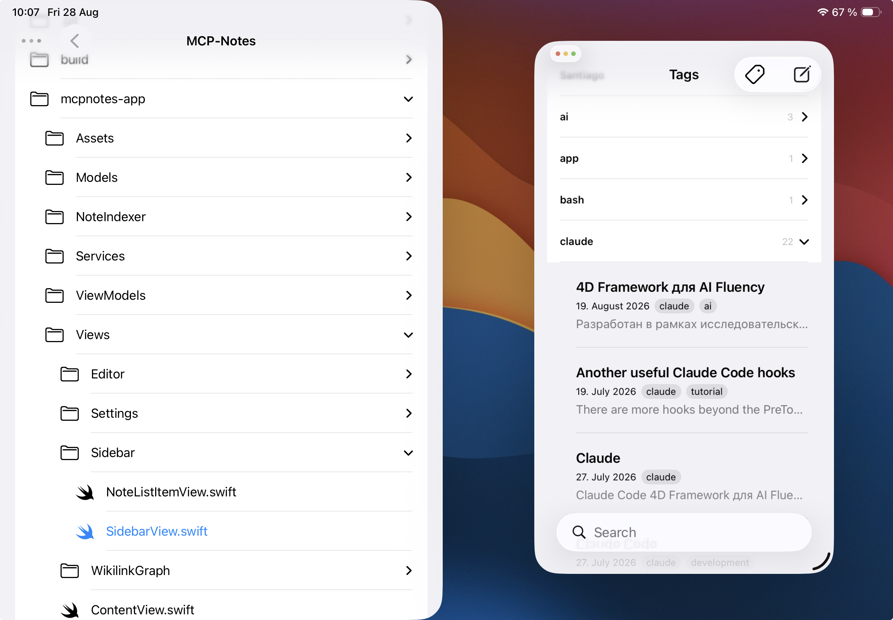

Звучить як суперечність: iPad став цілком робочим інструментом розробника, а зібрати під нього (і під iPhone) застосунок усе одно не можна без Mac. Xcode — єдине офіційне середовище збірки та підпису iOS-застосунків — існує тільки під macOS, і Apple явно не планує це змінювати. Чи означає це, що весь цикл розробки доведеться виконувати, сидячи за компʼютером? Ні — якщо Mac завжди доступний по мережі, а з iPad до нього можна дотягнутися віддалено.

## Remote IDE як робочий інтерфейс

Щоб керувати віддаленим Mac з iPad, потрібен не просто доступ по мережі, а зручний робочий інструмент. Тут у гру вступає [Remote IDE](https://apps.apple.com/app/remote-ide/id6762590018) — застосунок для iPadOS, що обʼєднує SSH-консоль, редактор коду з підсвіткою синтаксису та перегляд Git-diff в одному місці, з повною підтримкою Stage Manager. Для розробки iOS-застосунків на віддаленому Mac це закриває практично весь цикл:

- **SSH-консоль** — точка входу для запуску `xcodebuild`, git-команд і AI-агента (наприклад, [Claude Code](https://www.anthropic.com)) прямо на Mac. Облікові дані зберігаються тільки в Keychain пристрою.
- **Редактор з підключенням до віддаленої файлової системи** — відкриваєте `.swift`-файл на Mac так само, як локальний, правите вручну, якщо потрібно щось поправити самому, а не чекати на агента — збереження йде на Mac миттєво.
- **Git-вікно** — порядковий diff того, що змінив агент, без потреби ганяти `git diff` у консолі та читати текстовий вивід рядок за рядком на маленькому екрані термінала.

Усе це — окремі нативні вікна, якими Stage Manager керує незалежно: можна тримати консоль зліва, редактор справа, а diff — плаваючим вікном зверху.

## Чому Mac усе одно потрібен

Навіть за максимально агентного робочого процесу, де основну частину коду пише AI-агент, а не людина, є речі, які відбуваються тільки на macOS:

- **Компіляція та підпис.** `xcodebuild` і весь тулчейн Swift/Objective-C для iOS збираються й підписуються кодом тільки на Mac.
- **Встановлення на пристрій.** Розгорнути зібраний `.app` на підключений iPhone чи iPad теж можна тільки з Mac (або через TestFlight, але це окремий, набагато повільніший цикл).
- **Симулятор і Interface Builder-превʼю.** Live-превʼю SwiftUI, симулятор iOS — теж macOS-ексклюзив.

Іншими словами, «мозок» збірки принципово живе на Mac. Питання в тому, чи обовʼязково фізично перебувати поруч із цим Mac, щоб ним користуватися. Відповідь — ні.

## Як це виглядає на практиці: MCP Notes

Щоб не обмежуватися теорією, ось реальний сценарій із розробки [MCP Notes](https://github.com/sergeydi/MCP-Notes) — застосунку-нотаток з відкритим вихідним кодом, з тегами, семантичним (RAG) пошуком за вікі-посиланнями та спільною базою даних для Mac і iOS/iPadOS, — над яким зараз триває робота.

Проєкт уже збирається і запускається на Mac, але потрібно перевірити, як застосунок поводиться в режимі iPhone-сумісності на iPad (масштабований інтерфейс, а не нативний iPad-layout). Замість того щоб морочитися з цим руками, завдання формулюється агенту прямо в SSH-консолі Remote IDE: «збери iPhone-версію застосунку і встанови на мій iPad».

Агент (Claude Code) діє автономно: знаходить у проєкті налаштування `TARGETED_DEVICE_FAMILY`, підтверджує, що для конфігурації Debug воно вже виставлене в `1` (тільки iPhone), уточнює в користувача, на який фізичний iPad ставити збірку, запускає `xcodebuild`, встановлює і запускає застосунок — і все це через кілька shell-команд, виконаних на Mac по SSH, без жодного натискання в самому Xcode.

Поки агент працює над наступним завданням — править логіку бічної панелі (`SidebarView.swift`), додаючи окремий режим `.search` замість розбору `!searchText.isEmpty` по всьому коду, — редактор Remote IDE відкритий на тому самому файлі, підключеному напряму до файлової системи Mac.

Можна паралельно відкрити Git-вікно і рядок за рядком подивитися diff: де додався `preSearchMode`, як переписано `onChange` для збереження попереднього режиму під час входу та виходу з пошуку. Нічого не потрібно переказувати словами — весь патч видно рядок за рядком, зеленим і червоним.

Тут же, в окремому вікні файлового менеджера, зручно швидко пробігтися по структурі проєкту — `Models`, `NoteIndexer`, `Services`, `ViewModels`, `Views/Sidebar` — не виходячи із застосунку і не гортаючи вкладки Xcode.

## tmux: кілька паралельних сесій в одному SSH-зʼєднанні

Однієї SSH-сесії для комфортної роботи зазвичай мало: агенту потрібне своє вікно, а паралельно хочеться мати під рукою звичайний bash — прогнати тести, подивитися `git log`, вручну виконати команду, поки агент зайнятий своїм завданням. Вирішується це перемикачем **«Use tmux»** у налаштуваннях підключення Remote IDE: якщо він увімкнений, SSH-сесія обгортається в tmux прямо на сервері (у нашому випадку — на Mac).

Окрім очевидного плюсу — сесія переживає розрив звʼязку: закрили кришку iPad або втратили Wi-Fi, перепідключилися — і все на місці, включно з тим, що друкував агент, — це ще й зручний спосіб розділити одне SSH-зʼєднання на кілька незалежних вікон: одне під звичайний shell, друге — під Claude Code. У кожного проєкту — своя іменована tmux-сесія, тому агент і консоль для одного проєкту ніколи не плутаються із сусіднім, а перемикання між кількома паралельними завданнями — це просто перемикання tmux-вікна, а не пошук, куди поділася сесія. Рядок стану внизу консолі показує активне tmux-вікно поточної сесії, тож видно, де ви перебуваєте, не виходячи з термінала.

## Stage Manager: кілька вікон Remote IDE одночасно

Сам по собі tmux вирішує проблему кількох вікон *всередині* одного SSH-зʼєднання, але по-справжньому зручно це працює, коли поруч на екрані одночасно відкриті кілька незалежних вікон самого Remote IDE — а не вкладки всередині одного. Саме це й дає [Stage Manager](https://support.apple.com/en-gb/105075) в iPadOS 26: повноцінний багатовіконний режим із довільним розміром і розташуванням вікон, вікнами, що перекриваються, і швидким перемиканням між робочими наборами.

Типове розташування виглядає так: зліва — вікно з SSH-консоллю і Claude Code; справа — друге вікно Remote IDE з редактором і деревом файлів проєкту; і, за потреби, третє плаваюче вікно — зі статусом Git. Це незалежні нативні вікна застосунку, якими Stage Manager керує так само, як вікнами різних застосунків: перетягування, зміна розміру, запамʼятовування розташування між сесіями.

Загалом виходить робочий стіл, на якому агент пише і збирає код в одному вікні, поки ви одночасно гортаєте файли і diff у сусідніх — без жодного «сліпого» перемикання між вкладками.

## Віддалений доступ до Mac: Tailscale та його аналоги

Усе описане вище працює лише за однієї умови: Mac має бути доступний по мережі з будь-якої точки, де ви перебуваєте з iPad. Для цього не потрібна статична IP-адреса, прокидання портів чи складне налаштування VPN-сервера — достатньо застосунків штибу [Tailscale](https://tailscale.com), які будують mesh-мережу поверх WireGuard між вашими пристроями. Встановлюєте клієнт на Mac і на iPad, авторизуєтеся одним акаунтом — і Mac стає доступний за стабільною внутрішньою адресою, звідки б ви до нього не підключалися, чи то з дому, чи з кафе. SSH, VNC, будь-який самостійно піднятий сервіс на Mac — усе працює так, ніби ви в одній локальній мережі.

Це знімає головний практичний бар'єр: Mac може стояти вдома чи в офісі й бути виключеним з рівняння «де я фізично перебуваю» — а Remote IDE та AI-агент роблять усе інше.

## Підсумок

Відсутність Xcode під iPadOS — не глухий кут, а просто привід винести збірку на окрему машину і підключатися до неї віддалено. Звʼязка «Tailscale для мережевого доступу + Remote IDE як єдина точка входу в SSH, редактор і Git + AI-агент, який сам ганяє `xcodebuild`» закриває весь цикл розробки iPhone-застосунку прямо з iPad: від правки коду і рев'ю diff'ів до збірки і встановлення на реальний пристрій.

[MCP Notes](https://mcp-notes.com), про який ішлося вище, — активно розроблюваний застосунок з відкритим вихідним кодом ([репозиторій на GitHub](https://github.com/sergeydi/MCP-Notes)), і саме на ньому цей робочий процес обкатується на практиці день за днем.

Remote IDE — обговорити фічу, запропонувати ідею чи повідомити про проблему можна в [GitHub Issues](https://github.com/sergeydi/Remote-IDE_Support).

---

[Завантажити Remote IDE в App Store →](https://apps.apple.com/app/remote-ide/id6762590018)

---

**Теги:** iOS розробка, iPadOS, Xcode, Swift, віддалена розробка, Tailscale, SSH, AI-агенти, Claude Code, мобільна розробка
