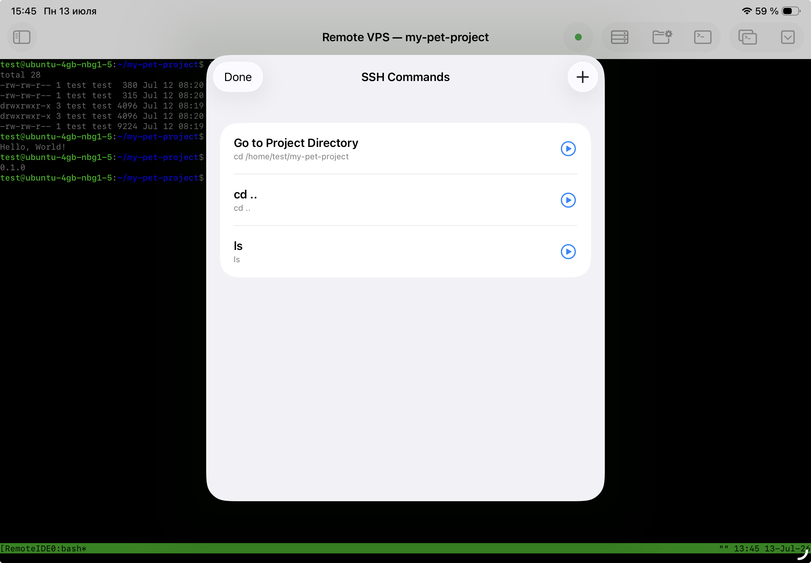

<h3>Your command library</h3>

Remote IDE lets you save any command you run frequently — build scripts, server restarts, test runners, deployment commands, log tails — under a short name. Open the Commands sheet, tap a command, and it executes instantly in your active SSH session.

Commands are shared across servers. If you run the same <code>npm run build</code> on three different servers, you only need to save it once.

<ul>
<li>Unlimited saved commands</li>
<li>Name + command text for each entry</li>
<li>Shared across all servers</li>
<li>Available in the main terminal and the AI agent window</li>
</ul>

<h3>Built-in: Go to Project Directory</h3>

Every commands sheet has a built-in entry at the top: <strong>Go to Project Directory</strong>. It runs <code>cd &lt;your configured remote path&gt;</code> instantly. This is the command you run every time you open a new terminal session, and it's always one tap away without having to type or remember the path.

<ul>
<li>Always at the top of the list</li>
<li>Uses the active remote path for the current server</li>
<li>Updates automatically when you change the active remote path</li>
</ul>

<h3>Add, edit, and delete</h3>

Commands are managed entirely within the app. Tap the + button in the commands sheet to add a new one. Swipe left on any command to reveal edit and delete actions. Changes take effect immediately — no restart, no sync step.

<ul>
<li>Add commands via the + toolbar button</li>
<li>Swipe left to edit or delete</li>
<li>Confirmation dialog before deletion</li>
</ul>

