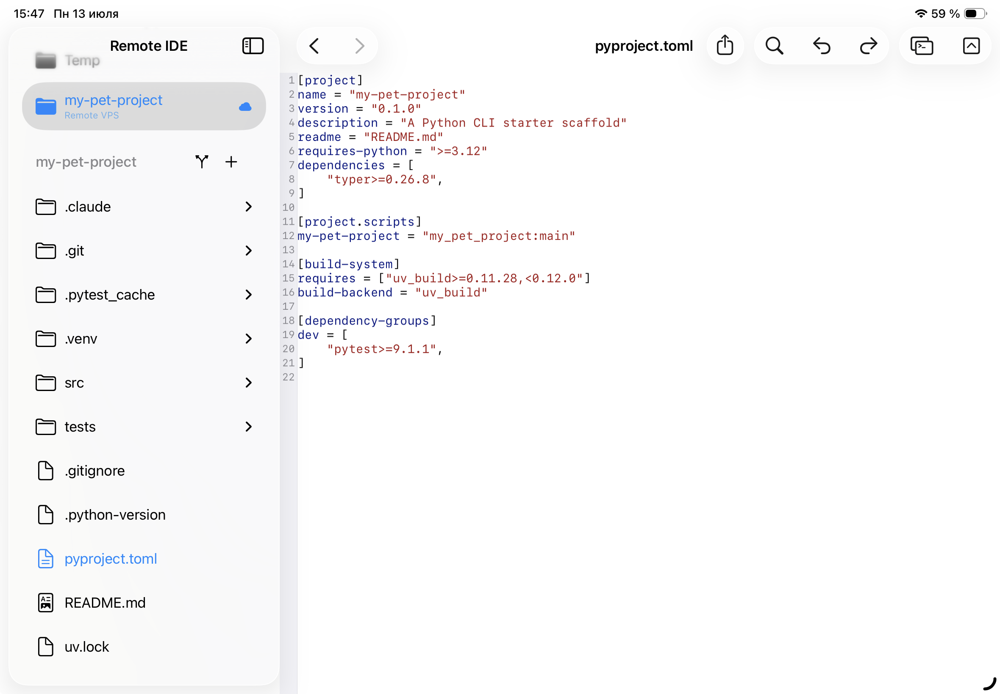

<h3>A VS Code-style color theme, adapted for iPad</h3>

The color scheme is inspired by Visual Studio Code's default dark and light themes — familiar if you already spend time in VS Code on your Mac. Keywords, strings, comments, types, and functions each get a distinct, readable color in both dark and light appearances — a TOML file, for example, gets clearly colored section headers, keys, and string values even in light mode.

The theme adapts automatically to your system appearance — no manual toggle in the app.

<ul>
<li>Keywords: blue (dark) / purple (light)</li>
<li>Strings: warm orange (dark) / dark red (light)</li>
<li>Types and classes: teal in both modes</li>
<li>Comments: italic green in both modes</li>
<li>Functions: warm yellow (dark) / brown (light)</li>
</ul>

<h3>Tree-sitter parsing — no regex shortcuts</h3>

Every language is parsed using <a href="https://tree-sitter.github.io/tree-sitter/" target="_blank" rel="noopener">Tree-sitter</a> — the same incremental parser used in Neovim, Helix, and VS Code. It builds a real syntax tree as you type, so highlighting stays accurate even in complex nested structures.

The editor uses a two-phase rendering strategy: plain text appears instantly when you open a file, and the fully highlighted state is built on a background thread and swapped in without blocking the UI.

<ul>
<li>Incremental re-parse on every edit — only changed subtrees are reprocessed</li>
<li>Background parsing keeps the UI responsive on large files</li>
<li>Accurate highlighting inside strings, templates, and multiline constructs</li>
</ul>

<h3>22 languages out of the box</h3>

Open any of the supported file types and the editor picks the right grammar automatically based on the file extension. No manual mode switching needed.

<ul>
<li>Swift, Python, JavaScript, TypeScript, TSX</li>
<li>Go, Rust, C, C++, Java, Ruby, PHP</li>
<li>Bash / Zsh / Shell, HTML, CSS, SCSS</li>
<li>JSON, YAML, TOML, Markdown, SQL</li>
</ul>

<h3>Editor settings you actually use</h3>

A small set of focused settings covers the things that matter most for coding on a touchscreen. No settings bloat — just the options that change how you work.

<ul>
<li>Font family and size — choose any monospaced font installed on your iPad</li>
<li>Line numbers on or off</li>
<li>Word wrap on or off</li>
<li>Indent with tabs or spaces, configurable width (2, 4, or custom)</li>
<li>Built-in find interaction — tap the search icon or use the keyboard shortcut</li>
</ul>

